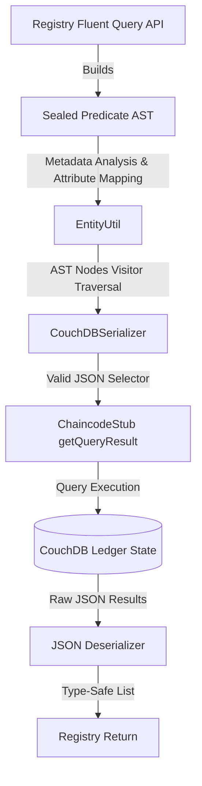
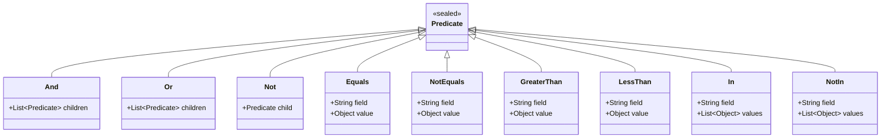

# Registry Concepts & Architecture

The Hypernate `Registry` acts as the central gateway for managing entity lifecycles and performing high-performance, type-safe queries against the Hyperledger Fabric ledger. It translates high-level object-oriented operations into low-level Fabric chaincode stub invocations.

This document details the architectural core of the advanced querying systems: **CouchDB Rich Query Builder** and **Range Query Builder**.

---

## 1. System Landscape & Data Flow

Below is the conceptual flow of a query lifecycle from the developer-facing Fluent API to physical ledger execution.

---

## 2. Core Abstractions & AST Design

Rather than building plain query strings dynamically (which introduces validation complexity and security vulnerabilities like selector injection), Hypernate utilizes an internal **Abstract Syntax Tree (AST)** represented by a modern Java **Sealed Interface** (`Predicate`).

### Sealed Predicate Hierarchy
Using a sealed interface ensures compile-time safety and enforces exhaustive pattern matching for serialization.

---

## 3. Metadata Analysis & Attribute Mapping

Different data types (e.g., integers, custom objects) are stored on the ledger as formatted strings. Hypernate matches user query criteria with the database schema by leveraging entity metadata via `EntityUtil`.

### Execution Flow:
1. **Reflection Validation**: Checks that fields exist recursively across the entity's entire inheritance hierarchy (`validateFieldExtant`), catching typos at construction time rather than during runtime.
2. **Annotation Scanning**: Inspects fields for `@PrimaryKey` or `@QueryIndex` annotations containing `@AttributeInfo` mappings.
3. **Implicit Value Transformation**: If an attribute defines a custom mapper (e.g., `IntegerZeroPadder`), the query builder automatically runs the value through the mapper *prior to serialization*. This guarantees query parameters match the physical storage layout (e.g., padding `10` to `0000000010` to preserve sorting lexicographically).

---

## 4. Range Query Builder

While CouchDB rich queries are powerful, they are restricted to state databases that support JSON selectors. For maximum portability, performance, and key-index utilization, the `RangeQueryBuilder` provides support for partial composite key range queries utilizing the native Fabric index structure.

* **Centralized Logic**: The `RangeQueryBuilder` leverages `EntityUtil.mapKeyPartsToString` to ensure that partial composite keys are padded and mapped identically to standard primary keys.
* **Deterministic Bounds**: Leverages native Fabric ledger indexing by automatically resolving entity names as key prefixes, facilitating high-speed scans.

---

## 5. Architectural Trade-offs & Scaling Considerations

### State Boundary Isolation (Committed State Only)
> [!IMPORTANT]  
> Rich queries and range queries execute directly against the CouchDB state database. They **reflect committed state only**. Uncommitted writes currently buffered in the transactional cache (e.g., `WriteBackCachedStubMiddleware`) are **NOT** visible. Developers must take this into account when designing multi-step transactions.

### Key Performance and Scaling Guidelines
* **Use Indexes strategically**: Always declare indexes matching your query criteria using `@QueryIndex`. Non-indexed rich queries result in full-database scans, which degrades ledger throughput.
* **Use Skip and Limit**: Always utilize pagination (`limit` and `skip`) when dealing with large datasets to avoid memory exhaustion during deserialization.
* **Range Queries vs. Rich Queries**: For prefix or composite key scans, prefer `RangeQueryBuilder`. It utilizes Fabric's high-speed local indexing and bypasses CouchDB JSON processing overhead.
